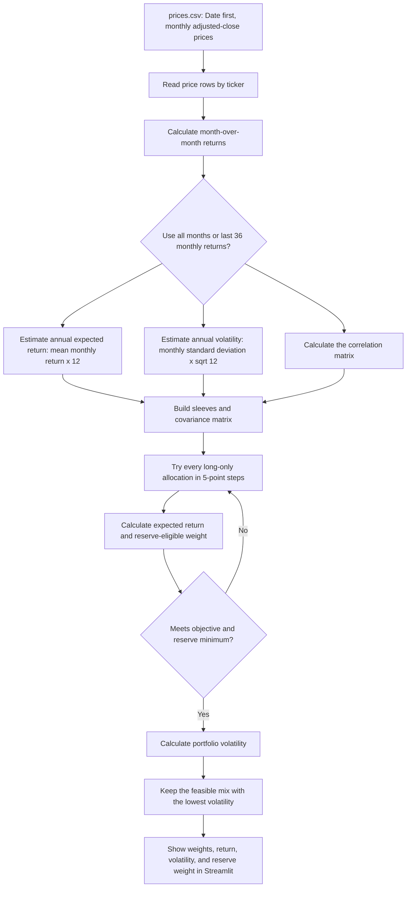

# Lab 15 — Portfolio Stability Decision

## Portfolio engine flowchart

```mermaid
flowchart TD
    A[prices.csv: Date first, monthly adjusted-close prices] --> B[Read price rows by ticker]
    B --> C[Calculate month-over-month returns]
    C --> D{Use all months or last 36 monthly returns?}
    D --> E[Estimate annual expected return: mean monthly return x 12]
    D --> F[Estimate annual volatility: monthly standard deviation x sqrt 12]
    D --> G[Calculate the correlation matrix]
    E --> H[Build sleeves and covariance matrix]
    F --> H
    G --> H
    H --> I[Try every long-only allocation in 5-point steps]
    I --> J[Calculate expected return and reserve-eligible weight]
    J --> K{Meets objective and reserve minimum?}
    K -- No --> I
    K -- Yes --> L[Calculate portfolio volatility]
    L --> M[Keep the feasible mix with the lowest volatility]
    M --> N[Show weights, return, volatility, and reserve weight in Streamlit]
```
